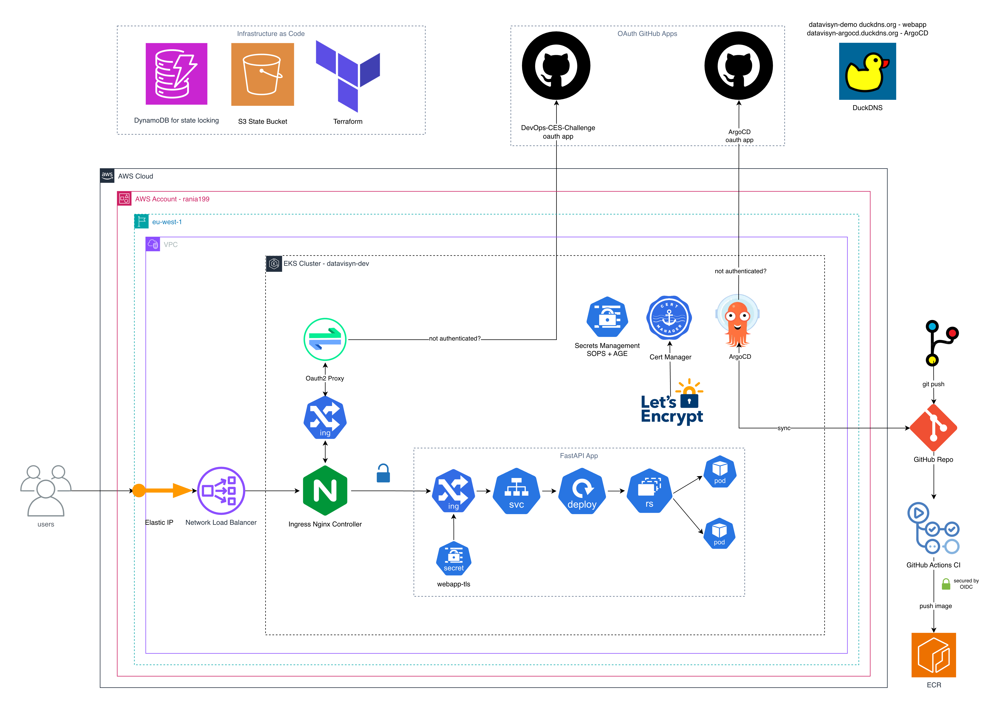
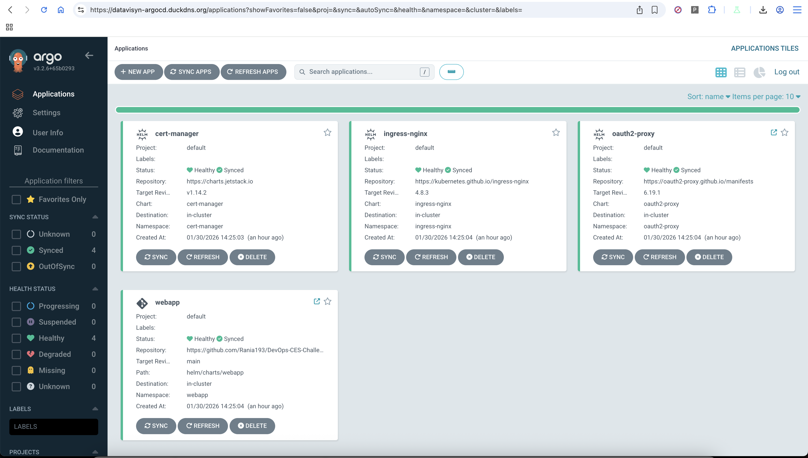
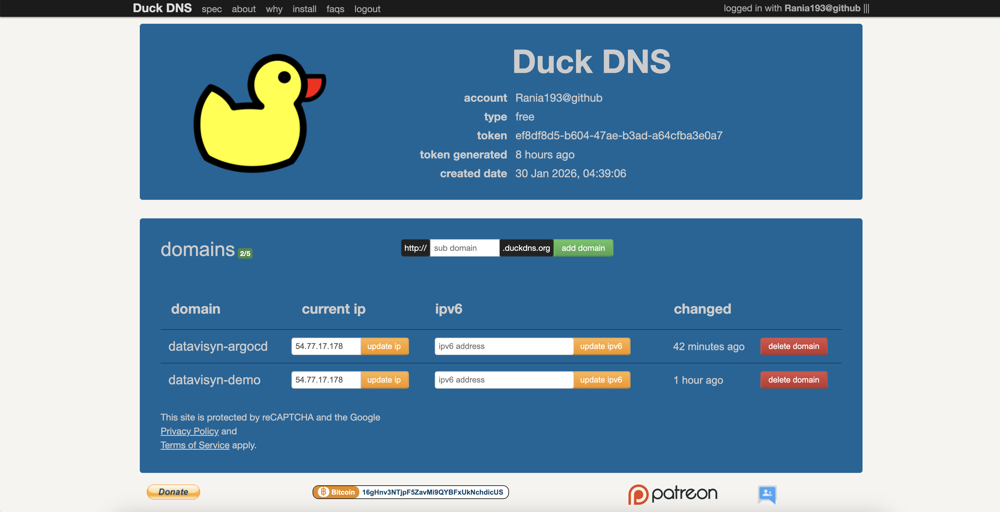

# Datavisyn DevOps Challenge

A Kubernetes deployment on AWS EKS with GitHub OAuth authentication, encrypted secrets management, GitOps continuous deployment, and automated CI/CD pipeline.

---

## Architecture Overview

The platform is deployed on AWS using an EKS (Elastic Kubernetes Service) cluster. The architecture leverages several key components for security, automation, and scalability. Below is a high-level overview:



### Key Components

- **AWS EKS Cluster**: Hosts all Kubernetes workloads.  
  [AWS EKS Documentation](https://docs.aws.amazon.com/eks/)

- **Elastic IP + Network Load Balancer**: Provides a static IP address for consistent DNS configuration. Traffic is forwarded to the Ingress Controller.  
  [AWS Elastic IP](https://docs.aws.amazon.com/AWSEC2/latest/UserGuide/elastic-ip-addresses-eip.html)

- **Ingress Controller (NGINX)**: Handles routing, TLS termination, and forwards requests to internal services.  
  [NGINX Ingress Controller](https://kubernetes.github.io/ingress-nginx/)

- **OAuth2 Proxy**: Secures access to the webapp by authenticating users via GitHub OAuth.  
  [OAuth2 Proxy](https://oauth2-proxy.github.io/oauth2-proxy/)

- **Webapp (FastAPI)**: A Python-based web application demonstrating the deployment. Built as a Docker image and stored in AWS ECR.  
  [FastAPI](https://fastapi.tiangolo.com/)

- **GitHub Actions CI/CD**: Automated Docker builds and deployments. On every push to `main` that changes the webapp code, builds a new image, pushes to ECR, and updates Helm values for ArgoCD to deploy.  
  [GitHub Actions](https://docs.github.com/en/actions)

- **AWS ECR**: Container registry for storing Docker images. Integrated with GitHub Actions via OIDC for secure, credential-free authentication.  
  [AWS ECR](https://docs.aws.amazon.com/ecr/)

- **ArgoCD**: GitOps tool for continuous deployment. Monitors the GitHub repository and automatically syncs changes to the cluster.  
  [ArgoCD](https://argo-cd.readthedocs.io/)

- **cert-manager**: Automatically provisions and renews TLS certificates from Let's Encrypt.  
  [cert-manager](https://cert-manager.io/)

- **helm-secrets + SOPS**: Encrypts sensitive values (OAuth credentials, API keys) so they can be safely stored in Git.  
  [helm-secrets](https://github.com/jkroepke/helm-secrets)

- **DuckDNS**: Free dynamic DNS service for custom domain names.  
  [DuckDNS](https://www.duckdns.org/)

---

## Project Structure

```
.github/
  workflows/
    deploy.yaml          # GitHub Actions CI/CD pipeline

webapp/                  # FastAPI application source code
  main.py               # Application code
  requirements.txt      # Python dependencies
  Dockerfile            # Docker image build instructions

argocd/
  apps/                  # ArgoCD Application manifests (one per component)
  config/                # ArgoCD server configuration (OAuth, Ingress)

helm/
  charts/
    webapp/              # Custom Helm chart for the webapp
  values/                # Value overrides for external charts

secrets/
  secrets.enc.yaml       # Encrypted secrets (safe to commit)
  secrets.yaml.example   # Template showing required structure

terraform/
  bootstrap/             # S3 backend for Terraform state
  modules/
    eks/                 # EKS cluster configuration
    iam/                 # IAM roles and policies (includes GitHub Actions OIDC)
    vpc/                 # VPC, subnets, NAT gateway
    ecr/                 # ECR repository for Docker images

docs/
  screenshots/           # Application screenshots
  CI_CD_MIGRATION.md    # CI/CD setup and migration guide
```

---

## Component Details

### 1. Webapp (FastAPI)

A Python FastAPI application that displays a simple web interface. The application is built as a Docker image and stored in AWS ECR. 

**CI/CD Pipeline:**
- Code changes in `webapp/` trigger GitHub Actions
- Docker image is built and tagged with commit SHA (e.g., `a3b8c2d`)
- Image is pushed to ECR
- Helm values are automatically updated with new tag
- ArgoCD detects the change and deploys the new image

**Important:** The pipeline only triggers on commits that change files in `webapp/` or `.github/workflows/deploy.yaml`. Commits that only change README, Terraform, or Helm charts will **not** trigger a build, avoiding unnecessary image builds.

**Screenshots:**


### 2. OAuth2 Proxy

Protects the webapp by requiring GitHub authentication before access is granted. Users who are not logged in are redirected to GitHub's OAuth flow.

- Integrates with GitHub OAuth for authentication
- Sets a secure cookie after successful login
- Only authenticated users can access the webapp

### 3. Ingress Controller (NGINX)

Handles all incoming HTTP/HTTPS traffic and routes requests to the appropriate backend services based on hostname.

- `datavisyn-demo.duckdns.org` → Webapp (via OAuth2 Proxy)
- `datavisyn-argocd.duckdns.org` → ArgoCD dashboard

TLS certificates are automatically provisioned by cert-manager.

### 4. ArgoCD

Manages application deployments using GitOps principles. When changes are pushed to the GitHub repository, ArgoCD detects them and automatically syncs the cluster state.

**Screenshots:**




### 5. cert-manager

Automatically requests and renews TLS certificates from Let's Encrypt using the HTTP-01 challenge. Certificates are stored as Kubernetes secrets and mounted by the Ingress Controller.

### 6. Secrets Management (SOPS + age)

Secrets are encrypted locally using SOPS with age encryption before being committed to Git. ArgoCD uses the helm-secrets plugin to decrypt these values at deployment time.

This approach allows:
- Secrets to be version-controlled alongside infrastructure code
- No plaintext secrets ever stored in Git
- Easy secret rotation via standard Git workflows

---

## Authentication Flow

1. **User Access**
   - User navigates to `https://datavisyn-demo.duckdns.org`
   - The Load Balancer forwards traffic to the NGINX Ingress Controller

2. **Authentication Check**
   - The Ingress Controller checks authentication status via OAuth2 Proxy
   - If not authenticated, the user is redirected to GitHub OAuth

3. **GitHub OAuth**
   - User logs in with their GitHub credentials
   - GitHub redirects back to `/oauth2/callback` with an authorization code
   - OAuth2 Proxy exchanges the code for a token and sets a session cookie

4. **Access Granted**
   - Subsequent requests include the session cookie
   - OAuth2 Proxy validates the cookie and forwards the request to the webapp

5. **Continuous Deployment**
   - GitHub Actions builds Docker image on code changes
   - Image is pushed to ECR with commit SHA as tag
   - Helm values are updated automatically
   - ArgoCD monitors the GitHub repository for changes
   - When Helm values change, ArgoCD syncs the cluster state and deploys the new image

---

## Setup Instructions

### Prerequisites

- AWS account with IAM permissions for EKS, VPC, IAM, and ECR
- GitHub account for OAuth, repository hosting, and Actions
- Command-line tools: `terraform`, `kubectl`, `helm`, `aws`, `sops`, `age`

### 1. Clone the Repository

```bash
git clone https://github.com/Rania193/DevOps-CES-Challenge.git
cd DevOps-CES-Challenge
```

### 2. Configure SOPS Encryption

Generate an age key for encrypting secrets:

```bash
mkdir -p ~/.config/sops/age
age-keygen -o ~/.config/sops/age/keys.txt

# Add to your shell profile
export SOPS_AGE_KEY_FILE=~/.config/sops/age/keys.txt
```

Update `.sops.yaml` with your age public key.

### 3. Provision Infrastructure with Terraform

Bootstrap the Terraform state backend:

```bash
cd terraform/bootstrap
terraform init && terraform apply
```

Deploy the infrastructure:

```bash
cd ..
terraform init && terraform apply
```

This creates the VPC, EKS cluster, IAM roles, Elastic IP, ECR repository, and GitHub Actions OIDC role. Takes approximately 15-20 minutes.

**Note:** Add `github_repo = "Rania193/DevOps-CES-Challenge"` to `terraform.tfvars` to enable GitHub Actions OIDC integration.

### 4. Update Ingress-NGINX Configuration

After Terraform creates the infrastructure, you need to update the ingress-nginx configuration with the actual subnet ID and EIP allocation ID:

```bash
# Get the current values
SUBNET_ID=$(terraform output -raw nlb_subnet_id)
EIP_ALLOC_ID=$(terraform output -raw nlb_eip_allocation_id)

# Update the ingress-nginx values file
sed -i '' "s|\(.*service.beta.kubernetes.io/aws-load-balancer-subnets: \)\".*\"|\1\"$SUBNET_ID\"|" ../helm/values/ingress-nginx.yaml
sed -i '' "s|\(.*service.beta.kubernetes.io/aws-load-balancer-eip-allocations: \)\".*\"|\1\"$EIP_ALLOC_ID\"|" ../helm/values/ingress-nginx.yaml

# Verify the changes
grep -E "subnets|eip-allocations" ../helm/values/ingress-nginx.yaml

# IMPORTANT: Commit and push the changes so ArgoCD can sync them
git add ../helm/values/ingress-nginx.yaml
git commit -m "Update ingress-nginx with subnet and EIP allocation IDs"
git push
```

**Important:** 
- If you recreate the infrastructure, these IDs will change and you must update them again.

### 5. Configure kubectl

```bash
aws eks update-kubeconfig --region eu-west-1 --name datavisyn-dev-cluster
kubectl get nodes
```

### 6. Get the Static IP

```bash
terraform output nlb_eip_public_ip
```

Note this IP - you will use it for DNS configuration.

### 7. Configure DNS (DuckDNS)

Go to [DuckDNS](https://www.duckdns.org) and create two domains pointing to your Elastic IP:

| Domain | Purpose |
|--------|---------|
| `datavisyn-demo.duckdns.org` | Main webapp |
| `datavisyn-argocd.duckdns.org` | ArgoCD dashboard |




### 8. Create GitHub OAuth Apps

Create two OAuth applications at [GitHub Developer Settings](https://github.com/settings/developers):

**Webapp OAuth App:**
- Homepage URL: `https://datavisyn-demo.duckdns.org`
- Callback URL: `https://datavisyn-demo.duckdns.org/oauth2/callback`

**ArgoCD OAuth App:**
- Homepage URL: `https://datavisyn-argocd.duckdns.org`
- Callback URL: `https://datavisyn-argocd.duckdns.org/api/dex/callback`

### 9. Configure Secrets

Edit the encrypted secrets file in the root directory of the project with your webapp OAuth credentials:

```bash
sops secrets/secrets.enc.yaml
```

Update the values:
```yaml
oauth2:
  clientID: "your-webapp-client-id"
  clientSecret: "your-webapp-client-secret"
  cookieSecret: "generate-with-openssl-rand-base64-32"
```

### 10. Install ArgoCD

```bash
kubectl create namespace argocd
kubectl apply -n argocd -f https://raw.githubusercontent.com/argoproj/argo-cd/stable/manifests/install.yaml
kubectl wait --for=condition=Ready pods --all -n argocd --timeout=300s
```

### 10.5. Fix Ingress-NGINX Webhook (if needed)

After ingress-nginx is installed via ArgoCD, you may need to fix the admission webhook CA bundle. This is a known issue where the webhook certificate isn't always properly configured.

**Check if fix is needed:**
```bash
# Try to create a test ingress - if it fails with TLS certificate error, run the fix
kubectl get ingress -n webapp 2>&1 | grep -q "certificate" && echo "Fix needed" || echo "OK"
```

**Apply the fix:**
```bash
./scripts/fix-ingress-nginx-webhook.sh
```

**Note:** This only needs to be done once after ingress-nginx installation. If you destroy and recreate the cluster, you'll need to run this again.

### 11. Configure ArgoCD for helm-secrets

```bash
# Create secret with age key
kubectl -n argocd create secret generic helm-secrets-private-keys \
  --from-file=key.txt=$HOME/.config/sops/age/keys.txt

# Enable helm-secrets schemes
kubectl patch configmap argocd-cm -n argocd --type merge -p \
  '{"data":{"helm.valuesFileSchemes":"secrets+age-import,secrets+age-import-kubernetes,secrets,https"}}'

# Apply repo-server patch
kubectl patch deployment argocd-repo-server -n argocd \
  --patch-file argocd/config/argocd-repo-server-patch.yaml
```

### 12. Configure ArgoCD OAuth

Add ArgoCD OAuth credentials:

```bash
kubectl -n argocd patch secret argocd-secret --type='json' -p="[
  {\"op\": \"add\", \"path\": \"/data/dex.github.clientID\", \"value\": \"$(echo -n 'YOUR_ARGOCD_CLIENT_ID' | base64)\"},
  {\"op\": \"add\", \"path\": \"/data/dex.github.clientSecret\", \"value\": \"$(echo -n 'YOUR_ARGOCD_CLIENT_SECRET' | base64)\"}
]"
```

Apply ArgoCD configuration:

```bash
# Apply configmaps and ingress (exclude the patch file which is already applied)
kubectl apply -f argocd/config/argocd-cmd-params-cm.yaml
kubectl apply -f argocd/config/argocd-github-oauth.yaml
kubectl apply -f argocd/config/argocd-ingress.yaml

# Restart deployments to pick up ConfigMap changes:
kubectl -n argocd rollout restart deployment argocd-server argocd-dex-server
```

**Verify the ingress is created:**
```bash
kubectl get ingress -n argocd
```

You should see `argocd-server-ingress` with an ADDRESS (the NLB hostname). The TLS certificate will be automatically issued by cert-manager, which may take 1-2 minutes. Check certificate status:

```bash
kubectl get certificate -n argocd
# Wait until READY shows "True"
```

**If certificate stays in "False" state:**

This usually means DNS is not correctly configured. Verify:
1. Both DuckDNS domains point to the same Elastic IP
2. DNS has propagated (can take a few minutes)
3. The IP matches your NLB's Elastic IP

If DNS is wrong, update DuckDNS, then delete and recreate the certificate:
```bash
kubectl delete certificate argocd-server-tls -n argocd
# Certificate will be automatically recreated by the ingress
```

### 13. Configure GitHub Actions

Get the GitHub Actions IAM role ARN:

```bash
cd terraform
terraform output github_actions_role_arn
```

Add this as a GitHub Secret:
1. Go to your repository → Settings → Secrets and variables → Actions
2. Click "New repository secret"
3. Name: `AWS_ROLE_ARN`
4. Value: (output from above)

Get the ECR repository URL:

```bash
terraform output ecr_repository_url
```

Update `helm/charts/webapp/values.yaml`:

```yaml
frontend:
  image:
    repository: "<account-id>.dkr.ecr.eu-west-1.amazonaws.com/webapp"  # Use output above
    tag: "latest"
    pullPolicy: Always
```

### 14. Deploy Applications

Commit and push your configuration, then deploy:

```bash
git add -A && git commit -m "Configure deployment" && git push
kubectl apply -f argocd/apps/
```

**Note:** This command applies ArgoCD Application manifests (not the webapp resources directly). ArgoCD will then:
1. Read the Helm charts from your repository
2. Deploy the actual Kubernetes resources (Deployments, Services, Ingress, etc.)
3. Manage them automatically with sync policies

You can verify the deployment in the ArgoCD UI or with:
```bash
kubectl get applications -n argocd
kubectl get pods -n webapp
```

**Important:** 
- The webapp pods will initially fail with `ImagePullBackOff` because ECR is empty. This is expected! The image will be created when you trigger the CI/CD pipeline in the next step.

### 15. Trigger Initial Build (Required)

Since ECR is initially empty, you need to trigger GitHub Actions to build and push the first image:

```bash
# Make a small change to trigger the build (or just touch the file)
echo "# Initial build" >> webapp/main.py
git add webapp/main.py
git commit -m "Trigger initial build"
git push
```

GitHub Actions will:
1. Build the Docker image
2. Push it to ECR (with both commit SHA tag and `latest` tag)
3. Update `helm/charts/webapp/values.yaml` with the new tag
4. ArgoCD will automatically detect and deploy the change

Wait for the workflow to complete, then check:
```bash
kubectl get pods -n webapp  # Should show Running status
```

### 16. Test CI/CD Pipeline

Make a change to `webapp/main.py` and push:

```bash
# Edit webapp/main.py (change the HTML message, for example)
git add webapp/main.py
git commit -m "Update webapp message"
git push
```

GitHub Actions will:
1. Build a new Docker image
2. Push to ECR with commit SHA tag
3. Update `helm/charts/webapp/values.yaml` with new tag
4. ArgoCD will automatically detect and deploy the change

**Note:** Only commits that change files in `webapp/` will trigger builds. Changes to README, Terraform, or Helm charts alone will not trigger a build.

---

## Access Links & Domains

| Service | URL | Notes |
|---------|-----|-------|
| Webapp | https://datavisyn-demo.duckdns.org | Protected by GitHub OAuth |
| ArgoCD | https://datavisyn-argocd.duckdns.org | GitOps dashboard |

---

## Secrets Rotation

### Rotating Webapp OAuth Credentials

```bash
# Edit encrypted secrets
sops secrets/secrets.enc.yaml

# Update the values, save, then commit
git add secrets/secrets.enc.yaml
git commit -m "Rotate OAuth credentials"
git push

# ArgoCD will automatically detect and apply the changes
```

### Rotating ArgoCD OAuth Credentials

```bash
# Update the secret
kubectl -n argocd patch secret argocd-secret --type='json' -p="[
  {\"op\": \"replace\", \"path\": \"/data/dex.github.clientSecret\", \"value\": \"$(echo -n 'NEW_SECRET' | base64)\"}
]"

# Restart the Dex server
kubectl -n argocd rollout restart deployment argocd-dex-server
```

### Rotating the age Encryption Key

```bash
# Generate new key
age-keygen -o new-key.txt

# Re-encrypt existing secrets
SOPS_AGE_KEY_FILE=new-key.txt sops --rotate --in-place secrets/secrets.enc.yaml

# Update .sops.yaml with the new public key
# Update the key in ArgoCD
kubectl -n argocd delete secret helm-secrets-private-keys
kubectl -n argocd create secret generic helm-secrets-private-keys \
  --from-file=key.txt=new-key.txt
```

---

## Cleanup / Teardown

See [docs/CLEANUP.md](docs/CLEANUP.md) for detailed instructions on tearing down the infrastructure.

---

## CI/CD Pipeline Details

### When Does It Build?

The GitHub Actions workflow **only triggers** when:
- Files in `webapp/` directory are changed (e.g., `main.py`, `requirements.txt`, `Dockerfile`)
- The workflow file itself is changed (`.github/workflows/deploy.yaml`)

This prevents unnecessary builds and saves GitHub Actions minutes.

### Image Tagging

- **Tag format**: First 7 characters of commit SHA (e.g., `a3b8c2d`)
- **Latest tag**: Also pushes as `latest` for convenience
- **Version tracking**: Each commit = unique image tag = easy rollback

### Authentication

GitHub Actions authenticates to AWS using **OIDC** (OpenID Connect):
- No AWS access keys stored in GitHub
- Temporary credentials (expire after 1 hour)
- Role can only be assumed from your specific repository
- More secure than long-lived credentials

---

## Notes

- All secrets are encrypted with SOPS and should never be committed in plaintext
- TLS certificates are automatically managed by cert-manager and renewed before expiration
- The Elastic IP ensures the load balancer IP never changes, simplifying DNS management
- Docker images are built automatically on webapp code changes
- For troubleshooting, check ArgoCD sync status, Kubernetes pod logs, and GitHub Actions workflow runs

---

## References

### Documentation

- [AWS EKS Documentation](https://docs.aws.amazon.com/eks/)
- [NGINX Ingress Controller](https://kubernetes.github.io/ingress-nginx/)
- [OAuth2 Proxy](https://oauth2-proxy.github.io/oauth2-proxy/)
- [ArgoCD](https://argo-cd.readthedocs.io/)
- [cert-manager](https://cert-manager.io/)
- [helm-secrets](https://github.com/jkroepke/helm-secrets)
- [SOPS](https://github.com/getsops/sops)

### Terraform Providers

- [hashicorp/aws](https://registry.terraform.io/providers/hashicorp/aws/latest)
- [hashicorp/kubernetes](https://registry.terraform.io/providers/hashicorp/kubernetes/latest)
- [hashicorp/helm](https://registry.terraform.io/providers/hashicorp/helm/latest)

### Helm Charts

- [ingress-nginx](https://artifacthub.io/packages/helm/ingress-nginx/ingress-nginx)
- [oauth2-proxy](https://artifacthub.io/packages/helm/oauth2-proxy/oauth2-proxy)
- [cert-manager](https://artifacthub.io/packages/helm/cert-manager/cert-manager)
- [argo-cd](https://artifacthub.io/packages/helm/argo/argo-cd)

### Additional Resources

- [GitHub Actions Documentation](https://docs.github.com/en/actions)
- [AWS ECR Documentation](https://docs.aws.amazon.com/ecr/)
- [GitHub Actions OIDC with AWS](https://docs.github.com/en/actions/deployment/security-hardening-your-deployments/configuring-openid-connect-in-amazon-web-services)
