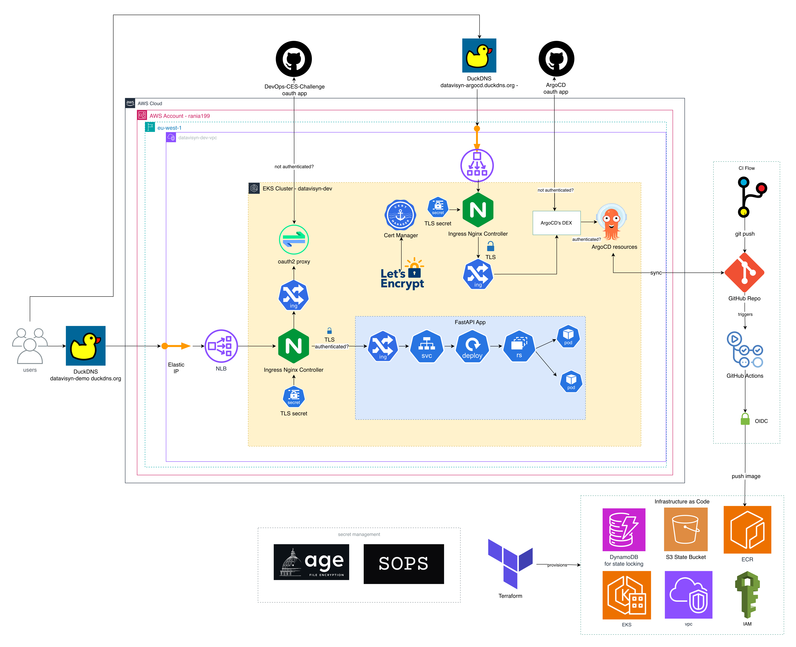

# Datavisyn DevOps Challenge

A Kubernetes deployment on AWS EKS with GitHub OAuth authentication, encrypted secrets management, and GitOps continuous deployment.

---

## Architecture Overview

The platform is deployed on AWS using an EKS (Elastic Kubernetes Service) cluster. The architecture leverages several key components for security, automation, and scalability. Below is a high-level overview:



### Key Components

- **AWS EKS Cluster**: Hosts all Kubernetes workloads.  
  [AWS EKS Documentation](https://docs.aws.amazon.com/eks/)

- **Elastic IP + Network Load Balancer**: Provides a static IP address for consistent DNS configuration. Traffic is forwarded to the Ingress Controller.  
  [AWS Elastic IP](https://docs.aws.amazon.com/AWSEC2/latest/UserGuide/elastic-ip-addresses-eip.html)

- **Ingress Controller (NGINX)**: Handles routing, TLS termination, and forwards requests to internal services.  
  [NGINX Ingress Controller](https://kubernetes.github.io/ingress-nginx/)

- **OAuth2 Proxy**: Secures access to the webapp by authenticating users via GitHub OAuth.  
  [OAuth2 Proxy](https://oauth2-proxy.github.io/oauth2-proxy/)

- **Webapp (FastAPI)**: A Python-based web application demonstrating the deployment.  
  [FastAPI](https://fastapi.tiangolo.com/)

- **ArgoCD**: GitOps tool for continuous deployment. Monitors the GitHub repository and automatically syncs changes to the cluster.  
  [ArgoCD](https://argo-cd.readthedocs.io/)

- **cert-manager**: Automatically provisions and renews TLS certificates from Let's Encrypt.  
  [cert-manager](https://cert-manager.io/)

- **helm-secrets + SOPS**: Encrypts sensitive values (OAuth credentials, API keys) so they can be safely stored in Git.  
  [helm-secrets](https://github.com/jkroepke/helm-secrets)

- **DuckDNS**: Free dynamic DNS service for custom domain names.  
  [DuckDNS](https://www.duckdns.org/)

---

## Project Structure

```
argocd/
  apps/                  # ArgoCD Application manifests (one per component)
  config/                # ArgoCD server configuration (OAuth, Ingress)

helm/
  charts/
    webapp/              # Custom Helm chart for the webapp
  values/                # Value overrides for external charts

secrets/
  secrets.enc.yaml       # Encrypted secrets (safe to commit)
  secrets.yaml.example   # Template showing required structure

terraform/
  bootstrap/             # S3 backend for Terraform state
  modules/
    eks/                 # EKS cluster configuration
    iam/                 # IAM roles and policies
    vpc/                 # VPC, subnets, NAT gateway

docs/
  screenshots/           # Application screenshots
```

---

## Component Details

### 1. Webapp (FastAPI)

A simple Python FastAPI application that returns a JSON response. The application code is injected via a Kubernetes ConfigMap, allowing updates without rebuilding the container image.

**Screenshots:**


### 2. OAuth2 Proxy

Protects the webapp by requiring GitHub authentication before access is granted. Users who are not logged in are redirected to GitHub's OAuth flow.

- Integrates with GitHub OAuth for authentication
- Sets a secure cookie after successful login
- Only authenticated users can access the webapp

### 3. Ingress Controller (NGINX)

Handles all incoming HTTP/HTTPS traffic and routes requests to the appropriate backend services based on hostname.

- `datavisyn-demo.duckdns.org` → Webapp (via OAuth2 Proxy)
- `datavisyn-argocd.duckdns.org` → ArgoCD dashboard

TLS certificates are automatically provisioned by cert-manager.

### 4. ArgoCD

Manages application deployments using GitOps principles. When changes are pushed to the GitHub repository, ArgoCD detects them and automatically syncs the cluster state.

**Screenshots:**


### 5. cert-manager

Automatically requests and renews TLS certificates from Let's Encrypt using the HTTP-01 challenge. Certificates are stored as Kubernetes secrets and mounted by the Ingress Controller.

### 6. Secrets Management (SOPS + age)

Secrets are encrypted locally using SOPS with age encryption before being committed to Git. ArgoCD uses the helm-secrets plugin to decrypt these values at deployment time.

This approach allows:
- Secrets to be version-controlled alongside infrastructure code
- No plaintext secrets ever stored in Git
- Easy secret rotation via standard Git workflows

---

## Authentication Flow

1. **User Access**
   - User navigates to `https://datavisyn-demo.duckdns.org`
   - The Load Balancer forwards traffic to the NGINX Ingress Controller

2. **Authentication Check**
   - The Ingress Controller checks authentication status via OAuth2 Proxy
   - If not authenticated, the user is redirected to GitHub OAuth

3. **GitHub OAuth**
   - User logs in with their GitHub credentials
   - GitHub redirects back to `/oauth2/callback` with an authorization code
   - OAuth2 Proxy exchanges the code for a token and sets a session cookie

4. **Access Granted**
   - Subsequent requests include the session cookie
   - OAuth2 Proxy validates the cookie and forwards the request to the webapp

5. **Continuous Deployment**
   - ArgoCD monitors the GitHub repository for changes
   - When changes are detected, ArgoCD syncs the cluster state automatically

---

## Setup Instructions

### Prerequisites

- AWS account with IAM permissions for EKS, VPC, and IAM
- GitHub account for OAuth and repository hosting
- Command-line tools: `terraform`, `kubectl`, `helm`, `aws`, `sops`, `age`

### 1. Clone the Repository

```bash
git clone https://github.com/Rania193/DevOps-CES-Challenge.git
cd DevOps-CES-Challenge
```

### 2. Configure SOPS Encryption

Generate an age key for encrypting secrets:

```bash
mkdir -p ~/.config/sops/age
age-keygen -o ~/.config/sops/age/keys.txt

# Add to your shell profile
export SOPS_AGE_KEY_FILE=~/.config/sops/age/keys.txt
```

Update `.sops.yaml` with your age public key.

### 3. Provision Infrastructure with Terraform

Bootstrap the Terraform state backend:

```bash
cd terraform/bootstrap
terraform init && terraform apply
```

Deploy the infrastructure:

```bash
cd ..
terraform init && terraform apply
```

This creates the VPC, EKS cluster, IAM roles, and Elastic IP. Takes approximately 15-20 minutes.

### 4. Configure kubectl

```bash
aws eks update-kubeconfig --region eu-west-1 --name datavisyn-dev-cluster
kubectl get nodes
```

### 5. Get the Static IP

```bash
terraform output nlb_eip_public_ip
```

Note this IP - you will use it for DNS configuration.

### 6. Configure DNS (DuckDNS)

Go to [DuckDNS](https://www.duckdns.org) and create two domains pointing to your Elastic IP:

| Domain | Purpose |
|--------|---------|
| `datavisyn-demo.duckdns.org` | Main webapp |
| `datavisyn-argocd.duckdns.org` | ArgoCD dashboard |


### 7. Create GitHub OAuth Apps

Create two OAuth applications at [GitHub Developer Settings](https://github.com/settings/developers):

**Webapp OAuth App:**
- Homepage URL: `https://datavisyn-demo.duckdns.org`
- Callback URL: `https://datavisyn-demo.duckdns.org/oauth2/callback`

**ArgoCD OAuth App:**
- Homepage URL: `https://datavisyn-argocd.duckdns.org`
- Callback URL: `https://datavisyn-argocd.duckdns.org/api/dex/callback`

### 8. Configure Secrets

Edit the encrypted secrets file with your webapp OAuth credentials:

```bash
sops secrets/secrets.enc.yaml
```

Update the values:
```yaml
oauth2:
  clientID: "your-webapp-client-id"
  clientSecret: "your-webapp-client-secret"
  cookieSecret: "generate-with-openssl-rand-base64-32"
```

### 9. Install ArgoCD

```bash
kubectl create namespace argocd
kubectl apply -n argocd -f https://raw.githubusercontent.com/argoproj/argo-cd/stable/manifests/install.yaml
kubectl wait --for=condition=Ready pods --all -n argocd --timeout=300s
```

### 10. Configure ArgoCD for helm-secrets

```bash
# Create secret with age key
kubectl -n argocd create secret generic helm-secrets-private-keys \
  --from-file=key.txt=$HOME/.config/sops/age/keys.txt

# Enable helm-secrets schemes
kubectl patch configmap argocd-cm -n argocd --type merge -p \
  '{"data":{"helm.valuesFileSchemes":"secrets+age-import,secrets+age-import-kubernetes,secrets,https"}}'

# Apply repo-server patch
kubectl patch deployment argocd-repo-server -n argocd \
  --patch-file argocd/config/argocd-repo-server-patch.yaml
```

### 11. Configure ArgoCD OAuth

Add ArgoCD OAuth credentials:

```bash
kubectl -n argocd patch secret argocd-secret --type='json' -p="[
  {\"op\": \"add\", \"path\": \"/data/dex.github.clientID\", \"value\": \"$(echo -n 'YOUR_ARGOCD_CLIENT_ID' | base64)\"},
  {\"op\": \"add\", \"path\": \"/data/dex.github.clientSecret\", \"value\": \"$(echo -n 'YOUR_ARGOCD_CLIENT_SECRET' | base64)\"}
]"
```

Apply ArgoCD configuration:

```bash
kubectl apply -f argocd/config/
kubectl -n argocd rollout restart deployment argocd-server argocd-dex-server
```

### 12. Deploy Applications

Commit and push your configuration, then deploy:

```bash
git add -A && git commit -m "Configure deployment" && git push
kubectl apply -f argocd/apps/
```

---

## Access Links & Domains

| Service | URL | Notes |
|---------|-----|-------|
| Webapp | https://datavisyn-demo.duckdns.org | Protected by GitHub OAuth |
| ArgoCD | https://datavisyn-argocd.duckdns.org | GitOps dashboard |

---

## Secrets Rotation

### Rotating Webapp OAuth Credentials

```bash
# Edit encrypted secrets
sops secrets/secrets.enc.yaml

# Update the values, save, then commit
git add secrets/secrets.enc.yaml
git commit -m "Rotate OAuth credentials"
git push

# ArgoCD will automatically detect and apply the changes
```

### Rotating ArgoCD OAuth Credentials

```bash
# Update the secret
kubectl -n argocd patch secret argocd-secret --type='json' -p="[
  {\"op\": \"replace\", \"path\": \"/data/dex.github.clientSecret\", \"value\": \"$(echo -n 'NEW_SECRET' | base64)\"}
]"

# Restart the Dex server
kubectl -n argocd rollout restart deployment argocd-dex-server
```

### Rotating the age Encryption Key

```bash
# Generate new key
age-keygen -o new-key.txt

# Re-encrypt existing secrets
SOPS_AGE_KEY_FILE=new-key.txt sops --rotate --in-place secrets/secrets.enc.yaml

# Update .sops.yaml with the new public key
# Update the key in ArgoCD
kubectl -n argocd delete secret helm-secrets-private-keys
kubectl -n argocd create secret generic helm-secrets-private-keys \
  --from-file=key.txt=new-key.txt
```

---

## Cleanup / Teardown

**Important:** You cannot run `terraform destroy` directly. The Network Load Balancer is created by Kubernetes (not Terraform), and it holds a reference to the Elastic IP. Terraform will fail trying to delete the EIP while it's still in use.

Follow this order:

### 1. Delete Kubernetes Services (releases the Load Balancer)

```bash
# Delete the ingress-nginx service that created the NLB
kubectl delete svc ingress-nginx-controller -n ingress-nginx

# Or delete the entire namespace
kubectl delete namespace ingress-nginx
```

### 2. Wait for the NLB to be Deleted

The AWS cloud controller will delete the NLB when the service is removed. This can take 1-2 minutes.

```bash
# Verify no load balancers remain
aws elbv2 describe-load-balancers --query 'LoadBalancers[*].[LoadBalancerName,State.Code]' --output table
```

Wait until your NLB no longer appears in the list, or shows as "deleted".

### 3. Delete Remaining Kubernetes Resources

```bash
# Delete ArgoCD applications
kubectl delete -f argocd/apps/

# Delete namespaces
kubectl delete namespace argocd cert-manager oauth2-proxy webapp
```

### 4. Destroy Terraform Infrastructure

```bash
cd terraform
terraform destroy
```

### 5. Clean Up Terraform State Backend (Optional)

If you also want to remove the S3 bucket used for Terraform state:

```bash
cd terraform/bootstrap

# Empty the bucket first (required before deletion)
aws s3 rm s3://datavisyn-terraform-state-$(aws sts get-caller-identity --query Account --output text) --recursive

terraform destroy
```

### Quick Cleanup Script

For convenience, here's the full cleanup in one go:

```bash
#!/bin/bash
set -e

echo "Deleting ingress-nginx service..."
kubectl delete svc ingress-nginx-controller -n ingress-nginx --ignore-not-found

echo "Waiting for NLB to be released (60 seconds)..."
sleep 60

echo "Deleting namespaces..."
kubectl delete namespace ingress-nginx argocd cert-manager oauth2-proxy webapp --ignore-not-found

echo "Waiting for namespace cleanup (30 seconds)..."
sleep 30

echo "Running terraform destroy..."
cd terraform
terraform destroy -auto-approve

echo "Cleanup complete!"
```

---

## Notes

- All secrets are encrypted with SOPS and should never be committed in plaintext
- TLS certificates are automatically managed by cert-manager and renewed before expiration
- The Elastic IP ensures the load balancer IP never changes, simplifying DNS management
- For troubleshooting, check ArgoCD sync status and Kubernetes pod logs

---

## References

### Documentation

- [AWS EKS Documentation](https://docs.aws.amazon.com/eks/)
- [NGINX Ingress Controller](https://kubernetes.github.io/ingress-nginx/)
- [OAuth2 Proxy](https://oauth2-proxy.github.io/oauth2-proxy/)
- [ArgoCD](https://argo-cd.readthedocs.io/)
- [cert-manager](https://cert-manager.io/)
- [helm-secrets](https://github.com/jkroepke/helm-secrets)
- [SOPS](https://github.com/getsops/sops)

### Terraform Providers

- [hashicorp/aws](https://registry.terraform.io/providers/hashicorp/aws/latest)
- [hashicorp/kubernetes](https://registry.terraform.io/providers/hashicorp/kubernetes/latest)
- [hashicorp/helm](https://registry.terraform.io/providers/hashicorp/helm/latest)

### Helm Charts

- [ingress-nginx](https://artifacthub.io/packages/helm/ingress-nginx/ingress-nginx)
- [oauth2-proxy](https://artifacthub.io/packages/helm/oauth2-proxy/oauth2-proxy)
- [cert-manager](https://artifacthub.io/packages/helm/cert-manager/cert-manager)
- [argo-cd](https://artifacthub.io/packages/helm/argo/argo-cd)
